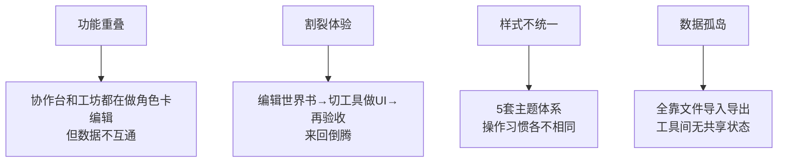

# RP-Hub-Toolkit 整合方案

> **本质目的**：将 7 个分散的 RP 角色卡制作工具整合为一个**自包含的 `index.html`**。
> 打开即用，双击即开，零依赖，零安装，随时随地都能用。

---

## 一、现状：7 个工具各自为战

现有 7 个工具存放在 `_originals/` 目录下（仅作参考，不做修改）：

| # | 工具名 | 行数 | 功能定位 |
|---|--------|:----:|----------|
| 1 | CC角色卡协作台 | 30,429 | 一站式 IDE |
| 2 | 角色卡工坊 | 13,159 | 轻量制卡 |
| 3 | 世界书助手 | 3,186 | 世界书编辑 |
| 4 | 变量UI辅助制作 | 3,455 | HTML 模板编辑 |
| 5 | 正则UI转化 | 673 | 正则替换工具 |
| 6 | 生图固定提示词助手 | 1,798 | 生图配置管理 |
| 7 | RP卡体检验收台 | 1,455 | 发布前质量检查 |

**总计约 54,000 行代码**，全部是纯前端 HTML/CSS/JS，零后端依赖。

### 存在的问题



---

## 二、核心目标

| # | 目标 | 说明 |
|---|------|------|
| 1 | **单一文件** | 最终产物只有一个 `index.html`，CSS 和 JS 全部内嵌 |
| 2 | **双击即用** | 不需要服务器，不需要构建，从文件系统直接打开 |
| 3 | **功能完整** | 保留 7 个工具的全部核心功能 |
| 4 | **体验统一** | 一套 UI 风格、一种操作逻辑 |
| 5 | **数据互通** | 所有功能共享同一份 localStorage 数据 |
| 6 | **保留原件** | `_originals/` 不动，作为参考和备查 |

---

## 三、项目结构

```
RP-Hub-Toolkit/
│
├── _originals/               ← 原件存档，只读不动
│   ├── CC角色卡协作台/
│   ├── 角色卡工坊/
│   ├── 世界书助手/
│   ├── 变量UI辅助制作/
│   ├── 正则UI转化/
│   ├── 生图固定提示词助手/
│   ├── RP卡体检验收台/
│   └── sw-register.js
│
├── index.html                ← 🎯 唯一产出物（内嵌所有 CSS + JS）
│
├── README.md                    ← 整合方案说明
│
├── checklist.md                 ← 整合流程步骤
│
├── ui-spec.md                   ← UI 设计规范（共享部分：布局/主题/组件/数据流）
│
├── ui/                          ← UI 设计规范（各模块独立文件）
│   ├── ui-home.md               ← 欢迎首页
│   ├── ui-card-editor.md        ← 角色卡编辑器
│   ├── ui-world-book.md         ← 世界书管理器
│   ├── ui-inspection.md         ← 体检验收台
│   ├── ui-builder.md            ← UI 模板实验室
│   ├── ui-regex-lab.md          ← 正则工坊
│   └── ui-prompt-lab.md         ← 生图提示词管理
│
├── ai-integration.md            ← AI 集成方案（给开发者）
│
└── .gitignore                   ← Git 排除规则
```

> 开发过程中的中间产物（如调试用的临时文件）**不入库**。
> 最终只提交 `_originals/` + `index.html` + 说明文档。

---

## 四、核心设计理念

### 4.1 单文件架构

```html
<!DOCTYPE html>
<html>
<head>
  <meta charset="UTF-8">
  <title>RP-Hub Toolkit</title>
  <style>
    /* ======= 所有 CSS 写在这里 ======= */
    /* 主题系统、布局、组件样式、各功能页面样式 */
  </style>
</head>
<body>
  <!-- ======= HTML 骨架 ======= -->
  <!-- 顶栏、侧边栏、内容区、各功能面板 -->

  <script>
    // ======= 所有 JS 写在这里 =======
    // 共享工具库、模块管理、各功能逻辑
  </script>
</body>
</html>
```

### 4.2 功能切换机制

采用 **SPA 路由**思想，所有功能面板预先写在 HTML 中，通过 display 切换显隐：

```html
<div id="page-home" class="page active">...</div>       <!-- 欢迎页 -->
<div id="page-card-editor" class="page">...</div>        <!-- 角色卡编辑 -->
<div id="page-world-book" class="page">...</div>         <!-- 世界书 -->
<div id="page-ui-builder" class="page">...</div>          <!-- UI模板 -->
<div id="page-regex-lab" class="page">...</div>           <!-- 正则 -->
<div id="page-prompt-lab" class="page">...</div>          <!-- 生图 -->
<div id="page-inspection" class="page">...</div>          <!-- 验收 -->
```

### 4.3 数据共享

所有功能通过 `app.storage` 读写同一份 `localStorage`，数据格式统一。

---

## 五、更新日志

| 日期 | 版本 | 变更说明 |
|------|:----:|----------|
| 2026-06-26 | v0.1 | 初始整合方案 + 流程步骤 |
