# RP-Hub-Toolkit 整合流程步骤

> 严格按"一个功能一个功能"的顺序推进，不做并行开发。
> **最终产出只有一个：`index.html`（内嵌所有 CSS 和 JS）。**
> 每个功能的开发方式：直接往 `index.html` 里追加对应的 HTML 结构、CSS 样式和 JS 逻辑。

---

## 整体路线图

```mermaid
graph LR
    subgraph 第一阶段-骨架
        A0[创建 index.html]
        A1[搭建整体布局<br/>顶栏+侧栏+内容区]
        A2[实现主题系统]
        A3[实现共享工具库<br/>app 对象]
        A4[实现欢迎页<br/>首页卡片导航]
        A5[实现模块切换机制]
    end

    subgraph 第二阶段-核心功能
        B1[角色卡编辑器<br/>全部内嵌到 index.html]
        B2[世界书管理器<br/>全部内嵌到 index.html]
        B3[体检验收台<br/>全部内嵌到 index.html]
    end

    subgraph 第三阶段-辅助功能
        C1[UI模板实验室<br/>全部内嵌到 index.html]
        C2[正则工坊<br/>全部内嵌到 index.html]
        C3[生图提示词管理<br/>全部内嵌到 index.html]
    end

    subgraph 第四阶段-收尾
        D1[全功能联调]
        D2[主题一致性检查]
        D3[导出导入测试]
        D4[复制index.html<br/>到各端验证]
    end

    A0 --> A1 --> A2 --> A3 --> A4 --> A5 --> B1 --> B2 --> B3 --> C1 --> C2 --> C3 --> D1 --> D2 --> D3 --> D4
```



---

## 第一阶段：骨架搭建

> 目标：搭好 `index.html` 的底座，后续功能只需要往里填内容。

---

### 步骤 1.1：创建 index.html

创建空的 `index.html`，写入基础骨架：

```html
<!DOCTYPE html>
<html lang="zh-CN" data-theme="light">
<head>
<meta charset="UTF-8">
<meta name="viewport" content="width=device-width, initial-scale=1.0">
<title>RP-Hub Toolkit</title>
<style>
/* 后续所有样式写在这里 */
</style>
</head>
<body>
<!-- 后续所有 HTML 写在这里 -->

<script>
/* 后续所有 JS 写在这里 */
</script>
</body>
</html>
```

**检查清单**：

- [ ] HTML 骨架完整
- [ ] 中文 lang 声明
- [ ] viewport 响应式设置
- [ ] data-theme 属性（亮/暗默认）

---

### 步骤 1.2：搭建整体布局

**界面布局**：

```
┌──────────────────────────────────────────────────────┐
│  RP-Hub Toolkit                        🌙  📋  ⚙️  │ ← 顶栏
├────────────┬─────────────────────────────────────────┤
│            │                                         │
│  🎴 角色卡   │         主内容区                       │
│            │   (page-home / 各功能页面)              │
│  📖 世界书   │                                         │
│            │                                         │
│  🎨 UI模板   │                                         │
│            │                                         │
│  🔧 正则    │                                         │
│            │                                         │
│  🖼 生图    │                                         │
│            │                                         │
│  ✅ 验收    │                                         │
│            │                                         │
├────────────┴─────────────────────────────────────────┤
│  v0.1 · 纯离线工具 · 数据存储在本地浏览器              │ ← 底栏
└──────────────────────────────────────────────────────┘
```

**HTML 结构**：

```html
<div id="app">
  <!-- 顶栏 -->
  <header id="header">
    <div class="header-left">
      <span class="logo">🎴 RP-Hub Toolkit</span>
    </div>
    <div class="header-right">
      <button onclick="app.toggleTheme()" title="切换主题">🌙</button>
      <button onclick="app.showSettings()" title="设置">⚙️</button>
      <button onclick="app.showDataManager()" title="数据管理">📋</button>
    </div>
  </header>

  <div id="main">
    <!-- 侧边栏 -->
    <nav id="sidebar">
      <a data-page="home">🏠 首页</a>
      <a data-page="card-editor">🎴 角色卡</a>
      <a data-page="world-book">📖 世界书</a>
      <a data-page="ui-builder">🎨 UI模板</a>
      <a data-page="regex-lab">🔧 正则</a>
      <a data-page="prompt-lab">🖼 生图</a>
      <a data-page="inspection">✅ 验收</a>
    </nav>

    <!-- 内容区 -->
    <main id="content">
      <div id="page-home" class="page active">...</div>
      <div id="page-card-editor" class="page">...</div>
      <!-- 更多页面... -->
    </main>
  </div>

  <!-- 底栏 -->
  <footer id="footer">v0.1 · 纯离线工具</footer>
</div>
```

**CSS 样式要点**：

```css
/* 布局 */
#app { height: 100vh; display: flex; flex-direction: column; }
#main { flex: 1; display: flex; overflow: hidden; }
#sidebar { width: 180px; flex-shrink: 0; overflow-y: auto; }
#content { flex: 1; overflow-y: auto; }

/* 页面切换 */
.page { display: none; }
.page.active { display: block; }

/* 侧边栏导航 */
#sidebar a { display: block; padding: 10px 16px; cursor: pointer; }
#sidebar a:hover { background: var(--bg-hover); }
#sidebar a.active { ... }
```

**检查清单**：

- [ ] 顶栏布局（标题 + 主题切换 + 设置 + 数据管理）
- [ ] 侧边栏（7个导航项：首页 + 6个功能）
- [ ] 侧边栏点击高亮效果
- [ ] 内容区容器
- [ ] 底栏（版本号）
- [ ] 所有页面容器 `<div class="page">` 占位

---

### 步骤 1.3：实现主题系统

**参考来源**：抽取 `角色卡工坊` / `世界书助手` / `CC角色卡协作台` 共享的 CSS 变量体系。

**核心色板**：

| 变量 | 亮色值 | 暗色值 | 用途 |
|------|--------|--------|------|
| `--bg` | #F7F8FC | #000000 | 页面背景 |
| `--bg-card` | #FFFFFF | #000000 | 卡片/面板 |
| `--bg-inset` | #EEF0F6 | #0C0C0C | 内嵌背景 |
| `--accent` | #4A6572 | #E8C8A0 | 主题色 |
| `--accent-h` | #3A525E | #D4B48C | 主题色 hover |
| `--tx` | #1A2B34 | #F0E6DC | 主文字 |
| `--tx2` | rgba(26,43,52,0.62) | rgba(240,230,220,0.62) | 次要文字 |
| `--bd` | rgba(74,101,114,0.10) | rgba(232,200,160,0.12) | 边框 |
| `--sh1` | 0 1px 3px ... | none | 卡片阴影 |
| `--err` | #C62828 | #E8C8A0 | 错误色 |
| `--ok` | #2E7D32 | #E8C8A0 | 成功色 |
| `--r-sm` / `--r-md` / `--r-lg` | 6/10/14px | 6/10/14px | 圆角 |

**通用样式**（全部写在 index.html 的 `<style>` 中）：

```css
/* 重置 */
*,*::before,*::after { margin:0; padding:0; box-sizing:border-box; }

/* 滚动条 */
::-webkit-scrollbar { width:6px; }
::-webkit-scrollbar-thumb { background:var(--bd2); border-radius:999px; }

/* 过渡动画 */
body, body * { transition-property: background-color,border-color,color,box-shadow; transition-duration:.35s; }

/* 按钮 */
.btn { ... }
.btn-primary { ... }
.btn-sm { ... }

/* 输入框 */
.input { ... }
.textarea { ... }

/* 标签 */
.tag { ... }

/* 响应式 */
@media (max-width: 768px) { ... }
```

**检查清单**：

- [ ] CSS 变量完整定义（亮/暗两套 via `[data-theme="dark"]`）
- [ ] reset 样式
- [ ] 滚动条样式
- [ ] 过渡动画
- [ ] .btn / .btn-primary / .btn-sm / .btn-danger
- [ ] .input / .textarea / .select
- [ ] .tag / .badge
- [ ] 响应式断点（<= 768px）

---

### 步骤 1.4：实现共享工具库（app 对象）

所有代码写在 `index.html` 的 `<script>` 中。

**API 设计**：

```javascript
const app = {
  // ===== UI 工具 =====
  toast(msg, type),         // 通知弹窗
  modal(html),              // 模态框
  confirm(msg),             // 确认框 → Promise<boolean>

  // ===== 存储 =====
  storage: {
    get(key), set(key, val), remove(key),
    clear(), export(), import(data),
  },

  // ===== AI 调用 =====
  llm({messages, model, temperature, maxTokens}),

  // ===== 工具函数 =====
  esc(str),                 // HTML 转义
  debounce(fn, ms),         // 防抖
  copy(str),                // 复制

  // ===== 主题 =====
  getTheme(), toggleTheme(),

  // ===== 页面切换 =====
  currentPage: 'home',
  navigateTo(pageName),     // 切换页面 + 更新侧边栏高亮
};
```

**检查清单**：

- [ ] app.toast() - 4种类型
- [ ] app.modal() - 动态内容 + 关闭
- [ ] app.confirm() - Promise
- [ ] app.storage 全部方法
- [ ] app.llm() - OpenAI 兼容格式
- [ ] app.esc()
- [ ] app.debounce()
- [ ] app.copy()
- [ ] app.getTheme() / app.toggleTheme()
- [ ] app.navigateTo() - 切换 page + 侧边栏高亮
- [ ] LLM 配置持久化

---

### 步骤 1.5：实现欢迎页

**界面**：

```
┌──────────────────────────────────────────────┐
│  🎴 RP-Hub Toolkit  v0.1                     │
│                                               │
│  欢迎使用 RP-Hub Toolkit                      │
│  选择下方功能卡片开始                          │
│                                               │
│  ┌──────────┐  ┌──────────┐  ┌──────────┐   │
│  │ 🎴 角色卡  │  │ 📖 世界书 │  │ 🎨 UI模板 │   │
│  │  编辑器   │  │  管理器  │  │  实验室  │   │
│  └──────────┘  └──────────┘  └──────────┘   │
│                                               │
│  ┌──────────┐  ┌──────────┐  ┌──────────┐   │
│  │ 🔧 正则  │  │ 🖼 生图   │  │ ✅ 验收   │   │
│  │  工坊    │  │ 提示词    │  │  检查台  │   │
│  └──────────┘  └──────────┘  └──────────┘   │
│                                               │
│  纯离线工具 · 数据存储在本地浏览器              │
└──────────────────────────────────────────────┘
```

**检查清单**：

- [ ] 欢迎标题 + 副标题
- [ ] 6张功能卡片（图标 + 名称 + 简短说明）
- [ ] 点击卡片 → app.navigateTo() 切换
- [ ] 卡片 hover 效果（放大 / 阴影变化）
- [ ] 响应式卡片布局

---

### 步骤 1.6：实现模块切换机制

**检查清单**：

- [ ] 侧边栏点击 → 切换 page + 高亮
- [ ] 欢迎页卡片点击 → 切换 page
- [ ] 各页面内"返回首页"按钮
- [ ] 切换时保存当前 page 名到 localStorage
- [ ] 页面刷新后恢复到上次的 page

---

## 第二阶段：核心功能

> 每个功能都直接在 `index.html` 中追加 HTML（对应 page 容器）、CSS、JS。
> **每完成一个功能，index.html 就变大一点**，最终合为一体。

---

### 步骤 2.1：角色卡编辑器

**来源**：CC角色卡协作台 + 角色卡工坊

**界面布局**：

```
┌──────────────────────────────────────────────────────┐
│  ← 首页         角色卡编辑器              保存  导出  │
├──────────────────────────────────────────────────────┤
│  ┌─────────┐  ┌──────────────────────────────────┐  │
│  │ 基础设定  │  │  名称: [________________]       │  │
│  │ 角色描述  │  │  版本: [________________]       │  │
│  │ 性格设定  │  │  作者: [________________]       │  │
│  │ 说话风格  │  │                                 │  │
│  │ 示例对话  │  │  描述:                          │  │
│  │ 导入JSON  │  │  [__________________________]  │  │
│  │ 导出JSON  │  │  [__________________________]  │  │
│  │         │  │                                 │  │
│  │         │  │  头像: [选择图片]               │  │
│  └─────────┘  └──────────────────────────────────┘  │
├──────────────────────────────────────────────────────┤
│  AI 辅助: [生成角色设定] [优化描述] [检查完整性]    │
└──────────────────────────────────────────────────────┘
```

**功能要点**：

| 功能 | 说明 |
|------|------|
| 基础设定编辑 | 名称、版本、作者、描述、头像 |
| 角色描述 | 性格、说话风格、示例对话 |
| JSON 导入 | 拖放或选择文件 |
| JSON 导出 | 下载 .json |
| diff 对比 | 导入两个版本高亮差异 |
| AI 辅助 | 生成设定 / 优化描述 / 检查完整性 |

**检查清单**：

- [ ] 左侧标签页切换（基础设定 / 角色描述 / 性格 / 说话风格 / 示例对话）
- [ ] 基础设定表单（名称、版本、作者）
- [ ] 描述多行文本编辑
- [ ] 性格设定编辑
- [ ] 说话风格编辑
- [ ] 示例对话编辑
- [ ] 头像上传预览
- [ ] JSON 导入（拖放 + 文件选择）
- [ ] JSON 导出下载
- [ ] diff 对比视图
- [ ] AI 辅助生成
- [ ] AI 辅助优化
- [ ] AI 辅助检查完整性
- [ ] 数据持久化
- [ ] 自动保存

---

### 步骤 2.2：世界书管理器

**来源**：世界书助手

**界面布局**：

```
┌──────────────────────────────────────────────────────┐
│  ← 首页         世界书管理器                   保存  │
├──────────────────────────────────────────────────────┤
│  ┌───── 条目列表 ─────┐  ┌── 条目详情编辑 ────────┐ │
│  │                     │  │  条目名: [_________]   │ │
│  │  [+] 新增条目       │  │  触发词: [_________]   │ │
│  │                     │  │  匹配: [全词▼]  [正则] │ │
│  │  📄 核01 · 核心规则   │  │                       │ │
│  │  📄 角03 · 角色名   │  │  内容:                │ │
│  │  📄 场05 · 场景描述  │  │  [________________]  │ │
│  │  📄 事02 · 主线事件  │  │  [________________]  │ │
│  │  ...                │  │                       │ │
│  │                     │  │  位置: [at_depth ▼]   │ │
│  │                     │  │  Order: [100]         │ │
│  │                     │  │  递归: [不可被递归 ☑] │ │
│  │                     │  │  概率: [100%]         │ │
│  │                     │  │  [保存]  [删除]       │ │
│  └─────────────────────┘  └──────────────────────┘ │
├──────────────────────────────────────────────────────┤
│  统计: 总条目 23 · 总字数 18,520 · 常驻 2 · 预算 35%│
│  AI: [检查触发词] [优化内容] [诊断完整性]             │
└──────────────────────────────────────────────────────┘
```

**检查清单**：

- [ ] 条目列表（搜索/筛选）
- [ ] 条目新增
- [ ] 条目编辑（名称、触发词、内容、位置、Order、递归、概率）
- [ ] 条目删除（带确认）
- [ ] 全词匹配 / 正则匹配切换
- [ ] 递归设置三种模式
- [ ] 插入位置选择（6种）
- [ ] Order 数值输入
- [ ] 触发概率滑块
- [ ] 总字数实时统计（标红 < 15000）
- [ ] 常驻占比统计
- [ ] 预算估算
- [ ] AI 诊断
- [ ] 数据持久化

---

### 步骤 2.3：体检验收台

**来源**：RP卡体检验收台

**界面布局**：

```
┌──────────────────────────────────────────────────────┐
│  ← 首页         体检验收台                     导出  │
├───────────┬──────────────────────┬───────────────────┤
│  导入区    │     评分与统计        │    审核对照       │
│           │                      │                   │
│  [选择]   │     ┌─────┐         │  ☐ 封面图片合规   │
│  或拖入   │     │ 85  │         │  ☐ 无涉政敏感内容  │
│  JSON    │     │ 分   │         │  ☐ 非抄袭/搬运    │
│           │     └─────┘         │  ☐ 质量标准达标    │
│  ──────── │                      │  ☐ 世界书≥15000字  │
│  ✓ 角色卡  │  总字数: 18,520 ✅   │  ☐ 标签规范        │
│  ✓ 世界书  │  条目数: 23 ✅       │  ☐ 核心维度达标    │
│  ✓ UI配置  │  常驻占比: 8% ✅     │                   │
│           │  触发词: 3 ⚠️        │  [刷新检查]       │
└───────────┴──────────────────────┴───────────────────┘
```

**检查清单**：

- [ ] 拖放解析 JSON
- [ ] 文件选择器
- [ ] 基础信息展示（名称、作者、版本）
- [ ] 总字数统计
- [ ] 条目数量
- [ ] 常驻占比
- [ ] 预算估算
- [ ] 触发词分析
- [ ] 环状评分图
- [ ] 10条审核红线逐项检查
- [ ] 综合评分
- [ ] 导出验收报告

---

## 第三阶段：辅助功能

### 步骤 3.1：UI 模板实验室

**来源**：变量UI辅助制作

**界面布局**：

```
┌──────────────────────────────────────────────────────┐
│  ← 首页         UI 模板实验室                 导出   │
├──────────────────────────────────────────────────────┤
│  ┌──── 代码编辑器 ──────────┐  ┌── 实时预览 ──────┐ │
│  │                           │  │                   │ │
│  │  [HTML] [CSS] [JS] 标签   │  │  [iframe 渲染     │ │
│  │                           │  │   结果]           │ │
│  │  <textarea>               │  │                   │ │
│  │  编辑区域                  │  │                   │ │
│  │  </textarea>               │  │                   │ │
│  │                           │  │                   │ │
│  └───────────────────────────┘  └──────────────────┘ │
├──────────────────────────────────────────────────────┤
│  变量模拟:  { "name":"小满", "hp":85 }  [应用]      │
│  模板: [状态栏] [地图] [开场白] [悬浮球]              │
└──────────────────────────────────────────────────────┘
```

**检查清单**：

- [ ] HTML/CSS/JS 三标签切换编辑
- [ ] iframe 实时预览
- [ ] 变量 JSON 输入 + 应用
- [ ] 内置模板（状态栏/地图/开场白/悬浮球）
- [ ] 导出完整 HTML
- [ ] 数据持久化

---

### 步骤 3.2：正则工坊

**来源**：正则UI转化

**检查清单**：

- [ ] 正则表达式输入
- [ ] 标志位输入（g/i/m/s）
- [ ] 测试文本输入
- [ ] 匹配结果高亮
- [ ] 替换文本输入
- [ ] 替换结果预览
- [ ] 匹配数量统计
- [ ] 模式库（保存/选择/删除）
- [ ] 无效正则错误提示

---

### 步骤 3.3：生图提示词管理

**来源**：生图固定提示词助手

**检查清单**：

- [ ] 提示词分类（亮点/负面/综合）
- [ ] 提示词 CRUD
- [ ] 参数配置（模型/尺寸/采样器/步数/CFG）
- [ ] 组合预览
- [ ] 一键复制
- [ ] AI 对话生成
- [ ] 导出/导入 JSON
- [ ] 数据持久化

---

## 第四阶段：收尾

### 步骤 4.1：全功能联调

| 验证项 | 说明 |
|--------|------|
| 角色卡 → 验收 | 编辑器保存的数据，验收台能读到 |
| 世界书 → 验收 | 世界书数据，验收台能统计字数 |
| 页面切换 | 6个功能页面之间切换流畅 |
| 数据一致性 | 一个页面修改数据后，其他页面读取正确 |

### 步骤 4.2：主题一致性检查

| 验证项 | 说明 |
|--------|------|
| 亮色主题 | 所有页面显示正常 |
| 暗色主题 | 所有页面显示正常 |
| 切换过渡 | 无闪烁/断层 |

### 步骤 4.3：导出导入测试

| 验证项 | 说明 |
|--------|------|
| 导出完整性 | localStorage 全部数据导出 |
| 导入还原 | 导入后数据一致 |

### 步骤 4.4：端到端验证

| 验证项 | 说明 |
|--------|------|
| 复制到新目录 | 把 index.html 单独复制到别的文件夹，双击打开 |
| 复制到U盘 | 从U盘直接打开，所有功能正常 |
| 换浏览器 | Chrome / Edge / Firefox 均可正常使用 |
| 断网测试 | 除 AI 功能外全部正常 |

---

## 进度跟踪

### 第一阶段：骨架

| 步骤 | 状态 |
|------|:----:|
| 1.1 创建 index.html | ⬜ |
| 1.2 整体布局（顶栏+侧栏+内容区） | ⬜ |
| 1.3 主题系统 | ⬜ |
| 1.4 共享工具库 app 对象 | ⬜ |
| 1.5 欢迎页（首页卡片导航） | ⬜ |
| 1.6 模块切换机制 | ⬜ |

### 第二阶段：核心功能

| 步骤 | 状态 |
|------|:----:|
| 2.1 角色卡编辑器 | ⬜ |
| 2.2 世界书管理器 | ⬜ |
| 2.3 体检验收台 | ⬜ |

### 第三阶段：辅助功能

| 步骤 | 状态 |
|------|:----:|
| 3.1 UI 模板实验室 | ⬜ |
| 3.2 正则工坊 | ⬜ |
| 3.3 生图提示词管理 | ⬜ |

### 第四阶段：收尾

| 步骤 | 状态 |
|------|:----:|
| 4.1 全功能联调 | ⬜ |
| 4.2 主题一致性检查 | ⬜ |
| 4.3 导出导入测试 | ⬜ |
| 4.4 端到端验证 | ⬜ |

---

## 更新日志

| 日期 | 版本 | 变更说明 |
|------|:----:|----------|
| 2026-06-26 | v0.1 | 初始整合流程步骤 |
